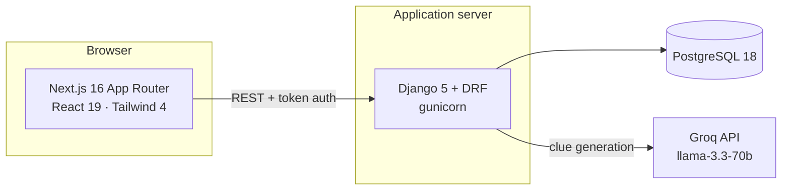

<div align="center">

# CrossWord Platform

**A full-stack academic assessment platform where teachers build crossword puzzles — by hand or with AI — and students solve them as timed, graded challenges.**

[](https://nextjs.org/)
[](https://react.dev/)
[](https://www.djangoproject.com/)
[](https://www.postgresql.org/)
[](https://docs.docker.com/compose/)
[](https://tailwindcss.com/)

</div>

---

## Overview

CrossWord turns teaching material into an interactive assessment. A teacher uploads a PDF or Word document and the platform uses a large language model to draft clue/answer pairs, lays them out on a valid crossword grid, and publishes it to their class. Students solve it against a timer; scores, rankings and per-clue analytics appear instantly.

The whole stack runs with a single `docker compose up`.



---

## Features

### Teacher Portal

| Area | Capability |
|---|---|
| **My Puzzles** | Dashboard of every puzzle with status (draft / published / archived), attempt counts, average score and attainment |
| **Create Puzzle** | Build manually, or generate from an uploaded **PDF/DOCX** using GenAI — set difficulty, question count and topic focus |
| **Add Content** | Edit clues, regenerate the grid layout, preview, and publish |
| **Students** | Import a class roster from CSV, reset passwords, remove students |
| **Leaderboard** | Per-puzzle rankings by score and completion time |
| **Analytics** | Average score, completion rate, average time, and the clues students most often get wrong |
| **Export** | Download any puzzle as a print-ready **PDF** or editable **Word** test paper, with a name / reg-no / date header |

### Student Portal

| Area | Capability |
|---|---|
| **Play Puzzles** | Interactive grid with cell-by-cell keyboard navigation and click-to-jump clue selection |
| **Timer** | Counts up while solving; the puzzle locks once submitted (one attempt per puzzle) |
| **My Attempts** | Full submission history with score, time taken and rank |
| **My Stats** | Personal performance summary across all puzzles |
| **Leaderboard** | Live standing against classmates |
| **Report / Re-analyse** | Review past attempts and see which answers were right or wrong |

### Admin Console

- Create and remove teacher accounts
- Platform-wide, read-only view of every student and the teacher they belong to

---

## Tech Stack

| Layer | Technology |
|---|---|
| **Frontend** | Next.js 16 (App Router), React 19, Tailwind CSS 4, lucide-react |
| **Backend** | Django 5, Django REST Framework, gunicorn, WhiteNoise |
| **Database** | PostgreSQL 18 |
| **AI generation** | Groq API — `llama-3.3-70b-versatile`, with multi-key rotation and failover |
| **Document parsing** | pdfplumber (PDF), python-docx (DOCX) |
| **PDF export** | ReportLab |
| **Infrastructure** | Docker Compose (frontend · backend · database) |

---

## Quick Start (Docker)

The fastest path — no Python or Node installation required.

**Prerequisites:** Docker Desktop, and a Groq API key from [console.groq.com](https://console.groq.com).

```bash
git clone https://github.com/shreyascode11/crossword-platform.git
cd crossword-platform

cp .env.example .env        # then fill in the values below
docker compose up --build -d
```

Set at minimum in `.env`:

```ini
POSTGRES_PASSWORD=<any strong password>
DJANGO_SECRET_KEY=<generate with the command below>
GROQ_API_KEY=<your Groq key>
```

```bash
python -c "import secrets; print(secrets.token_hex(50))"   # generates a secret key
```

Create your first admin account, then open the app:

```bash
docker compose exec backend python manage.py createsuperuser
```

| Service | URL |
|---|---|
| Frontend | http://localhost:3000 |
| Backend API | http://localhost:8000/api/ |

Database migrations and static files are applied automatically on startup.

**Common commands**

```bash
docker compose logs -f          # follow logs
docker compose down             # stop
docker compose down -v          # stop and wipe the database volume
docker compose up -d --build    # rebuild after code changes
```

---

## Local Setup (without Docker)

<details>
<summary><b>Expand for manual installation</b></summary>

<br>

**Prerequisites:** Python 3.11+, Node.js 20+, and a running PostgreSQL 14+ instance.

**1 · Database**

```bash
createdb crossword
```

**2 · Backend**

```bash
cd backend
python -m venv venv && source venv/bin/activate   # Windows: venv\Scripts\activate
pip install -r requirements.txt

cp .env.example .env        # set DB_* credentials and GROQ_API_KEY

python manage.py migrate
python manage.py createcachetable
python manage.py createsuperuser
python manage.py runserver                        # http://127.0.0.1:8000
```

**3 · Frontend** — in a second terminal

```bash
cd frontend-test
npm install
npm run dev                                       # http://localhost:3000
```

</details>

---

## Configuration

All configuration is environment-driven. Copy `.env.example` to `.env` and adjust.

### Required

| Variable | Description |
|---|---|
| `POSTGRES_PASSWORD` | Password for the database user |
| `DJANGO_SECRET_KEY` | Django signing key — must be unique and 32+ characters in production |
| `GROQ_API_KEY` | Groq API key used for AI clue generation |

### Deployment

| Variable | Default | Description |
|---|---|---|
| `NEXT_PUBLIC_API_URL` | `http://localhost:8000/api/` | API URL the **browser** calls. Baked in at build time — rebuild the frontend after changing it |
| `ALLOWED_HOSTS` | `localhost,127.0.0.1,backend` | Hostnames Django will serve |
| `CORS_ALLOWED_ORIGINS` | `http://localhost:3000` | Origins permitted to call the API |
| `CSRF_TRUSTED_ORIGINS` | *(empty)* | Required for HTTPS deployments, scheme included |
| `DJANGO_SECURE` | `False` | Enables SSL redirect, HSTS and secure cookies. Turn on **only** once served over HTTPS |

### Optional

| Variable | Default | Description |
|---|---|---|
| `GROQ_API_KEY_2`, `GROQ_API_KEY_3` | — | Additional keys; requests rotate across the pool and fail over when one is rate-limited |
| `AUTH_TOKEN_TTL_HOURS` | `12` | Session lifetime before re-authentication is required |
| `LOGIN_MAX_ATTEMPTS` | `8` | Failed logins per user + IP before lockout |
| `LOGIN_LOCKOUT_SECONDS` | `900` | Lockout duration |

---

## Security

Because the platform stores student records and runs graded assessments, the API is built so that **identity and role always come from the authenticated token — never from client-supplied parameters**.

- **Answers are never sent to students.** Clue answers are stripped from every student-facing response, and the role behind that decision is read from the session token, so it cannot be spoofed with a query parameter.
- **Ownership enforcement.** Teachers can only read or modify their own puzzles, clues and class roster; cross-account access returns `403`.
- **Submissions are bound to the sender.** A student's registration number is taken from their token, preventing submission on another student's behalf.
- **Password hashing** via Django's PBKDF2 for all teacher and student accounts.
- **Session expiry and server-side logout** — tokens carry a TTL and are revoked on sign-out.
- **Login rate limiting** with temporary lockout after repeated failures, backed by a shared cache so it holds across all worker processes.
- **Production hardening** — SSL redirect, HSTS, secure cookies, `nosniff` and `X-Frame-Options: DENY`, all behind the `DJANGO_SECURE` flag.

> [!IMPORTANT]
> **Before deploying:** set a strong `DJANGO_SECRET_KEY` (the app refuses to start in production without one), point `NEXT_PUBLIC_API_URL` at your public URL and rebuild the frontend, then enable `DJANGO_SECURE=True` once TLS is in place.

---

## Project Structure

```
crossword-platform/
├── docker-compose.yml           # database + backend + frontend
├── .env.example                 # configuration template
├── backend/
│   ├── Dockerfile
│   ├── docker-entrypoint.sh     # migrate → collectstatic → gunicorn
│   ├── requirements.txt
│   ├── api/
│   │   ├── views.py             # REST endpoints, auth, AI generation, exports
│   │   ├── models.py            # Puzzle, Clue, Attempt, Teacher, Student, AuthToken
│   │   ├── serializers.py       # role-aware serialisation (hides answers)
│   │   ├── crossword_layout.py  # grid generation and word placement
│   │   └── urls.py
│   └── backend/settings.py
├── frontend-test/
│   ├── Dockerfile               # multi-stage build → Next.js standalone
│   ├── next.config.mjs
│   └── src/
│       ├── app/                 # App Router entrypoints
│       ├── components/          # Dashboard, CrosswordPlayer, role portals
│       └── lib/api.js           # API client with token auth
└── docs/
    ├── CrossWord-User-Guide.pdf # end-user guide for all three roles
    └── sample-students.csv      # roster import template
```

---

## Documentation

- **[User Guide (PDF)](docs/CrossWord-User-Guide.pdf)** — how to use the platform, written for teachers, students and admins
- **[Sample roster](docs/sample-students.csv)** — CSV template for bulk student import, in the format `name,reg_no,password`

---

## Contributors

- [**@shreyascode11**](https://github.com/shreyascode11)
- [**@prince-rai88**](https://github.com/prince-rai88)
